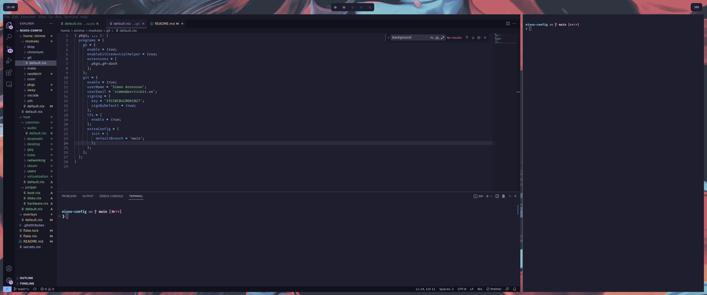

  <h1>❄️</h1>
  simskij's NixOS and home-manager configuration.

## Machines

| Hostname  | Model                    | OS     | Role    |
| --------- | ------------------------ | ------ | ------- |
| `juniper` | Ryzen 5950X Custom Build | NixOS  | Desktop |
| `willow`  | Ryzen 5950X Custom Build | NixOS  | Server  |
| `spruce`  | Macbook Air M2           | MacOS  | Laptop  |
| `dev`     | Multipass VM             | Ubuntu | Server  |

## Screenshots

